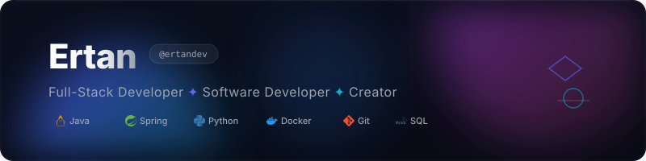

<div align="center">
  <!-- Upload banner_cozy.svg to your repository root and this will render it -->
  

  <br/>
  <br/>

  <p align="center">
    <strong>Full-Stack Developer &amp; Tech Enthusiast</strong>
  </p>

<p>
    <a href="https://github.com/ertandev">
      
    </a>
    <a href="https://www.linkedin.com/in/ertanyolcu">
      
    </a>
    
    
  </p>
</div>


---

###  Welcome / Hoş Geldiniz!

*  **EN:** Hi there! I'm Ertan, a software developer based in Turkey. I enjoy building applications that are user-focused, practical, and clean. Whether it's tracking game hours, analyzing markets, or designing simple single-page apps, I love turning logic into working products.
*  **TR:** Merhaba! Ben Ertan. Türkiye'de yaşayan bir yazılım geliştiriciyim. Kullanıcı odaklı, pratik ve temiz uygulamalar geliştirmekten keyif alıyorum.

---

###  ABOUT ME / HAKKIMDA

```javascript
const developer = {
  username: "ertandev",
  skills: ["Full-Stack", "Web Development", "Game Analytics"],
  philosophy: "Turn coffee and time-tracking metrics into beautiful interfaces.",
  activeCodingHours: "Late Night",
};
```

---

###  TECH ORBIT / TEKNOLOJİ YÖRÜNGESİ

<div align="center">
  <!-- Core Languages & Frameworks -->
  
  
  
  

  <br/>

  <!-- Tooling & Ops -->
  
  
  
  
</div>

---

###  FEATURED RUNS / SEÇİLMİŞ PROJELER

<table width="100%">
  <tr>
    <td width="50%" valign="top">
      <h4> <a href="https://github.com/ertandev/Order-A-Taxi">Order-A-Taxi</a></h4>
      <p><em>Turkish:</em> Java Swing ve MySQL tabanlı, harita entegrasyonlu ve yolculuk simülasyonlu gelişmiş taksi rezervasyon masaüstü uygulaması.</p>
      <p><em>English:</em> A feature-rich desktop taxi booking and simulation application built with Java Swing and MySQL.</p>
      <br/>
      
      
      
    </td>
    <td width="50%" valign="top">
      <h4> <a href="https://github.com/ertandev/Game-Time-Tracker">Game-Time-Tracker</a></h4>
      <p><em>Turkish:</em> Oyun seanslarını otomatik takip eden, oyuncunun oyun alışkanlıklarını analiz etmesini sağlayan zaman yönetim aracı.</p>
      <p><em>English:</em> An automated gaming session timer and dashboard for performance metrics tracking.</p>
      <br/>
      
      
      
    </td>
  </tr>
  <tr>
    <td width="50%" valign="top">
      <h4> <a href="https://github.com/ertandev/Microsoft-LocalRAG">Microsoft-LocalRAG</a></h4>
      <p><em>Turkish:</em> Python tabanlı, SQL veritabanı üzerinde çalışan; yerel belgeler üzerinde semantik arama ve soru-cevap yapmayı sağlayan, Microsoft teknolojileriyle entegre çalışan Local RAG uygulaması.</p>
      <p><em>English:</em> A Python-based local Retrieval-Augmented Generation (RAG) system with a SQL database backend, integrated with Microsoft AI technologies for offline document querying.</p>
      <br/>
      
      
      
      
    </td>
    <td width="50%" valign="top">
      <h4> <a href="https://github.com/ertandev/obs-survey-autofill">obs-survey-autofill</a></h4>
      <p><em>Turkish:</em> Üniversite anketleri için gerçekçi dağılımlı, iOS Liquid Glass arayüze sahip tek tıkla otomatik doldurma eklentisi.</p>
      <p><em>English:</em> Intelligent one-click auto-filler for university evaluation surveys with iOS Liquid Glass UI and realistic distribution.</p>
      <br/>
      
      
      
    </td>
  </tr>
</table>

---

###  METRICS

<div align="center">
  <table border="0">
    <tr>
      <td>
        
      </td>
      <td>
        
      </td>
    </tr>
  </table>
  
  <br/>
  
  
</div>

---

<div align="center">
  <p> <em>"The best way to predict the future is to program it."</em></p>
</div>
